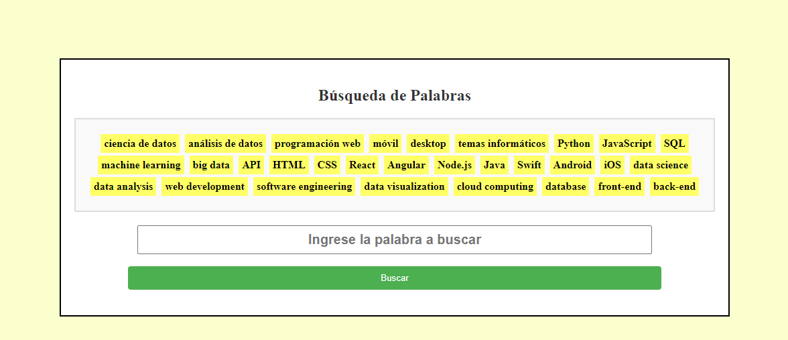
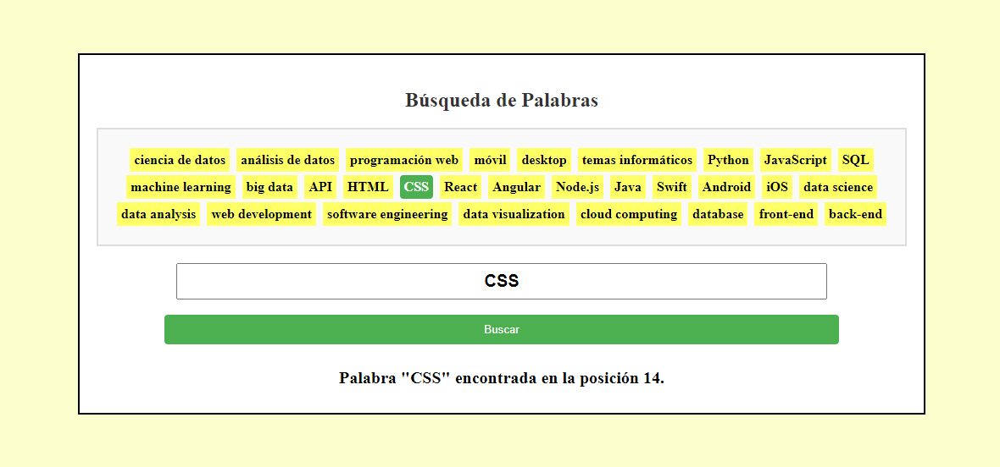
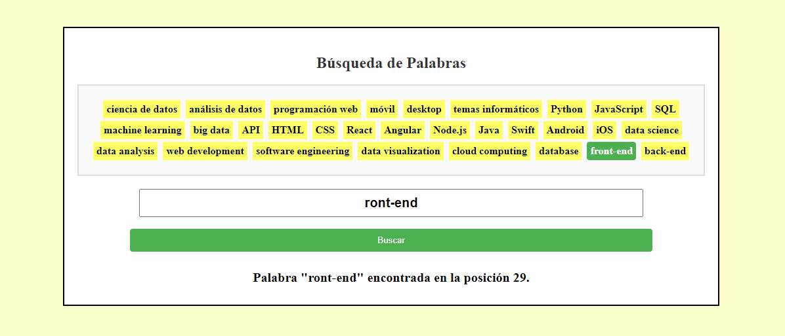

# Búsqueda de Palabras

Este proyecto es un ejercicio simple de búsqueda de palabras en una lista predefinida, implementado en HTML, CSS y JavaScript.

## Archivos y Estructura

- `index.html`: Contiene la estructura HTML de la página.
- `styles.css`: Archivo CSS con los estilos para la interfaz.
- `script.js`: Código JavaScript para la funcionalidad de búsqueda.

## Tecnologías Utilizadas

- HTML
- CSS
- JavaScript

## Uso

1. Clona o descarga el repositorio.
2. Abre `index.html` en tu navegador.
3. Ingresa una palabra en el campo de búsqueda y presiona "Buscar" para encontrar su posición en la lista.
4. Explora la lista predefinida de palabras.

## Licencia

Este proyecto está bajo la Licencia MIT. Consulta el archivo `LICENSE` para más detalles.

## Cómo Clonar

Puedes clonar este repositorio usando el siguiente comando:

## Cómo Compartir

Siéntete libre de compartir este proyecto con otros y contribuir si quieres mejorar la funcionalidad o el diseño.

## Cómo Contribuir

¡Las contribuciones son bienvenidas! Si tienes ideas para mejorar el proyecto, realiza un fork y crea una solicitud de extracción (pull request).

## Redes Sociales

No olvides suscribirte, compartir, darle like y dejar tus comentarios en la sección de abajo. ¡Tu apoyo es muy importante para mí y me ayudas a seguir creando contenido! 💚

1. 🎬 [Youtube](https://www.youtube.com/@JuancitoPenaV)
2. 👨‍💼 [LinkedIn](https://www.linkedin.com/in/juancitope%C3%B1a/)
3. 📰 [Blog](https://advisertecnology.com/)
4. 📷 [Instagram](https://www.instagram.com/juancito.pena.v/)
5. 📑 [Facebook](https://www.facebook.com/juancito.p.v)
6. 🐦 [Twitter](https://twitter.com/JuancitoPenaV)

